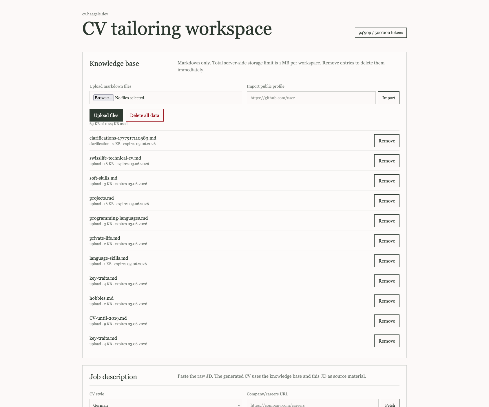

# cv.haegele.dev

AI-assisted CV and cover letter tailoring workspace on Cloudflare Workers.

Live demo: [cv.haegele.dev](https://cv.haegele.dev)



## Features

- Cloudflare D1 knowledge-base storage with 30-day retention.
- Immediate server-side deletion for removed files and "delete all data".
- Markdown knowledge-base uploads, max 1 MB per workspace.
- Allowlisted public profile import for GitHub, LinkedIn, Xing, and x.com.
- GitHub import includes profile metadata, public repositories, and README excerpts.
- Arbitrary HTTPS company/careers URL fetch with basic SSRF protections and stored summary.
- Workers AI-backed gap analysis, tailoring plan, Markdown CV, and Markdown cover letter generation.
- Streaming AI responses over SSE so generated documents appear live.
- Toast UI Editor Markdown rendering for clarifications, CVs, and cover letters.
- Generated CVs and cover letters are session-only and downloaded as Markdown.

## Local Development

```bash
npm ci
npm run db:migrate:local
npm run dev
```

Open:

```text
http://127.0.0.1:8787
```

## Cloudflare Setup

Required services:

- Cloudflare Workers
- Cloudflare D1
- Workers AI
- A Cloudflare-managed zone for the custom domain

`wrangler.toml` configures:

```toml
routes = [
  { pattern = "cv.haegele.dev", custom_domain = true }
]

[[d1_databases]]
binding = "DB"
database_name = "recruiting-haegele-dev"
database_id = "332a9525-1d29-44b9-9ead-2568e67acdc8"

[ai]
binding = "AI"
```

The hosted deployment uses `cv_`-prefixed tables in the existing `recruiting-haegele-dev` D1 database. The deploy workflow resolves that database, applies `src/db/schema.sql`, and deploys the Worker. For a fully separate self-hosted installation, create your own D1 database and update `wrangler.toml` plus the workflow database names.

## GitHub Actions Secrets

Required repository secrets:

| Secret | Purpose |
|---|---|
| `CLOUDFLARE_API_TOKEN` | Deploy Worker, create D1, apply schema, configure custom domain |
| `CLOUDFLARE_ACCOUNT_ID` | Target Cloudflare account |

Set secrets with GitHub CLI:

```bash
gh secret set CLOUDFLARE_API_TOKEN --repo <owner>/cv-haegele-dev
gh secret set CLOUDFLARE_ACCOUNT_ID --repo <owner>/cv-haegele-dev
```

## Deployment

Push to `main` or `master`, or run:

```text
Actions -> Deploy to Cloudflare -> Run workflow
```

Verify:

```bash
npm run smoke
```

## Privacy Model

This app stores uploaded knowledge-base files in Cloudflare D1 for 30 days. Removing a file deletes it immediately. The "Delete all data" action deletes the full workspace knowledge base and fetched company sources immediately. Generated CVs and cover letters are not persisted by the app.

## License

MIT
